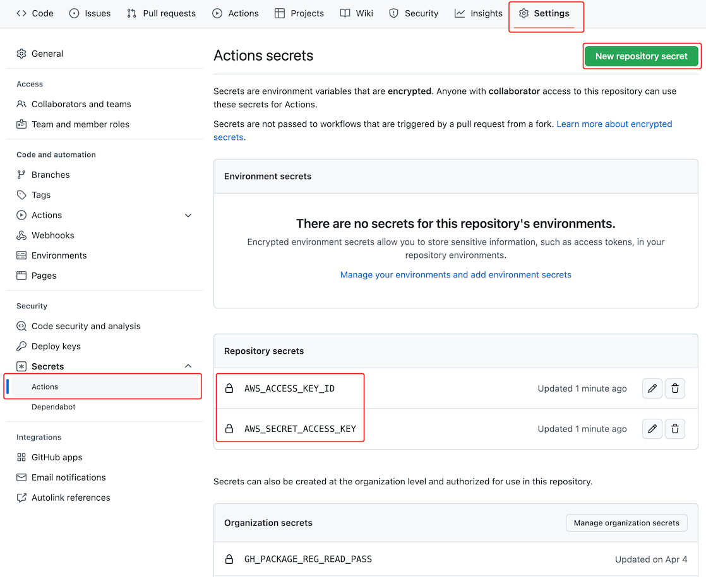

# Unit 5 Project Setup

This document outlines the different steps you'll need to follow in order to set things up for local development and remote deployment to AWS. It's a long document and looks like a lot, but there are really just a few things that we need to do:

- [AWS Profile Configuration](#aws-profile-configuration): yet another AWS profile
- [Development/Deployment Scenarios](#developmentdeployment-scenarios): how we'll deploy our code manually, and (even better) how we'll have GitHub do it automatically for us

## AWS Profile Configuration

We have 2 new profiles that we'll be using for this project: an individual profile that you'll use for your local development, and a team profile that you'll share with your team and use to deploy your code to AWS.

To do this run the command `aws configure sso` and provide the following inputs as prompted:

- SSO start URL: `https://nss-se.awsapps.com/start/`
- SSO Region: `us-east-2`
- Choose your individual account when prompted to choose an account.
- Choose the role `SE_Unit_5` when prompted to choose a role.
- CLI default client Region: press Enter to accept the default of `us-east-2`. _If the default is missing or different, enter `us-east-2`._
- CLI default output format: press Enter to accept the default of `json`.
- CLI profile name: The default name here is long and will be hard to remember. instead give it a name like `Unit5_Individual`.

After doing this, you can run this command: `cat ~/.aws/config`. The profiles that you used in previous units should still be there, but you should also see one for `Unit5_Individual` (that's the one we care about), it should look something like:

```ini
[profile Unit5_Individual]
sso_start_url = https://nss-se.awsapps.com/start/
sso_region = us-east-2
sso_account_id = AN_ACTUAL_ACCOUNT_ID
sso_role_name = SE_Unit_4
region = us-east-2
output = json
```

_Repeat this process choosing your group account and the role `SE_Unit_5_Group_TEAMNAME` to configure your group account profile. When prompted for the CLI profile name enter something like `Unit5_Group_TEAMNAME`._

> **NOTE:** You'll continue to authenticate with AWS using the appropriate profile the same way that you've been doing in previous units. If you need a refresher on the specific commands refer back to previous units.

## Development/Deployment Scenarios

We'll do most of our development locally with `sam` like we've been doing so far. Requests that access and/or manipulate data in DynamoDB will continue to reach out to the DynamoDB tables in AWS. There are 3 different scenarios that you will use. You should work through each Scenario in order the first time through to configure all the necessary parts.

### Scenario 1: Local Backend, Local Frontend

In this scenario you will run both the backend and frontend locally on your laptop. You should use your **individual** AWS account in this scenario so that all data in DDB is yours and yours alone. Even though we'll be running the backend locally, we need some DynamoDB tables created in AWS so the setup for this involves some remote AWS configuration.

1. Run the Lambda service (aka the backend):
   - Build the Java code: `sam build`
   - Create an S3 bucket: `aws s3 mb s3://nss-s3-c##-u5-project-YOUR.NAME` (Replace `c##` with your cohort number, e.g. `c01` for Cohort 1, and replace `YOUR.NAME` with your first and last name.)
      > **TIP:** You only need to do this once.
   - Deploy the SAM template: `sam deploy --s3-bucket BUCKET_FROM_ABOVE --parameter-overrides "S3Bucket=BUCKET_FROM_ABOVE"`
      > **NOTE:** _Yes you have to provide the same S3 bucket name twice. Yes this is annoying._
   - Create some sample data: `aws dynamodb batch-write-item --request-items file://data/data.json`
      > **TIP:** You only need to do this once.
      >
      > _The sample data provided here is specific to the Music Playlist Service, you will either delete or replace this when you start your own project, but it's quite useful for now when you're trying to get everything working._
   - Run the local API: `sam local start-api --warm-containers LAZY`
2. Run a local web server (aka the frontend):
   - Install dependencies : `npm install`
       > **TIP:** You only need to do this once - _unless_ you add/change Javascript dependencies.
   - Run the local server: `npm run run-local`

After doing all of this, you will have a server running on port `8000` - you can access it by going to [http://localhost:8000](http://localhost:8000) in your browser. Create a playlist, add some songs to it (see [data.json](./data/data.json) for sample ASIN and track numbers you can use).

To stop either the local backend (the `sam local...` command) or local frontend (the `npm run...`) command, simply press `Ctrl-C` in the terminal where the process is running.

### Scenario 2: Remote Backend, Local Frontend

In this scenario you will deploy the backend to AWS and run the frontend locally on your laptop. You should use your **individual** AWS account in this scenario so that all data in DDB is yours and yours alone.

1. Deploy the Lambda service (aka the backend):
   - Build the Java code: `sam build`
   - Deploy it: `sam deploy --s3-bucket BUCKET_FROM_ABOVE --parameter-overrides "S3Bucket=BUCKET_FROM_ABOVE"`
2. Get the ID of the API Gateway:
    ```shell
    aws cloudformation describe-stack-resource --stack-name music-playlist-service --logical-resource-id ServerlessRestApi | \
    jq '.StackResourceDetail.PhysicalResourceId'
    ```
    > **TIP:** This will be a 10 digit alphanumeric string. Alternatively you can login to the AWS web management console and get the ID from there.
3. Run a local web server (aka the frontend): `U5_API_RESOURCE_ID=ID_FROM_ABOVE npm run run-local`
    > **TIP:** The string `U5_API_RESOURCE_ID` is an [environment variable](https://en.wikipedia.org/wiki/Environment_variable) that the frontend configuration is looking for to know whether it should connect to the localhost or a remote host.

After doing all of this, you will have a server running on port `8000` - you can access it by going to [http://localhost:8000](http://localhost:8000) in your browser. The difference from Scenario 1 is that now the Lambda functions are running in AWS. If you open the developer tools in your browser you will see requests being made to a URL like `https://GATEWAY_RESOURCE_ID.execute-api.us-east-2.amazonaws.com/Prod`. Once you have made several requests this should be noticeably faster than running the code locally on your laptop.

### Scenario 3: Remote Backend, Remote Frontend

In this scenario all the code will be deployed to AWS. You should use your **group** AWS account in this scenario so that all data and code is shared by your team.

> **NOTE: Walk through these steps with your group.** The configuration steps only need to be done by one person on the team, and then your GitHub repo and AWS group account will be configured for the rest of the team.

#### One Time Configuration

> _One more reminder to make sure you're logged in with your **group** AWS account for this!_

Before this scenario will work, you need to perform a few steps:

1. Run `sam pipeline bootstrap`: This will create some AWS resources necessary to deploy your code. Use the following answers to the questions asked:
   - Stage definition: `ServiceStage`
   - Account details: Select your group profile (e.g. `Unit5_Group_TEAMNAME`)
   - Region: `us-east-2` _(this should be the default)_
   - User permissions provider: IAM _(this should be the default)_
   - "Enter the _____ ARN ... or we will create one for you": _leave all of these questions blank_
   - "Does your application contain any IMAGE type Lambda functions?": `N` _(this should be the default)_
   - Confirm the summary, and enter `y` to proceed with creation.
   - When you see the `Pipeline IAM user credential` output, save the values shown for `AWS_ACCESS_KEY_ID` and `AWS_SECRET_ACCESS_KEY`. You will not be shown these again, but will need to use them in the next step.

   <details>
      <summary><b>Click to see a screen recording of this step...</b></summary>
      
      <em>Figure 1: Screen recording of `sam pipeline bootstrap`. Several values have been replaced with fake or obfuscated values. Your list of AWS accounts may be different than what's shown here.</em>
   </details>

2. Go to the "Settings" page of your teams GitHub repository and click on "Secrets", then "Actions". Click the "New repository secret" button, and set the Name to `AWS_ACCESS_KEY_ID`, and the Secret to the value shown in the prior step, and then click the "Add secret" button. Repeat this for `AWS_SECRET_ACCESS_KEY` as well. When you have completed this you should see both listed in the "Repository secrets" section of this page. NOTE that you will only see the name, and not the secret. This is expected. You will also see some "Organization secrets" listed at the bottom of the page like `GH_PACKAGE_REG_READ_PASS` and `GH_PACKAGE_REG_READ_USER` - you do not need to do anything with these.

   <details>
      <summary><b>Click to see a screenshot of this step...</b></summary>
      
      <em>Figure 2: GitHub repository secrets configuration.</em>
   </details>

4. Run `sam pipeline init`: This will create the workflow file needed to enable GitHub Actions to build and deploy your code. Use the following answers to the questions asked (otherwise accept the default):
   - Pipeline template: "2 - Custom Pipeline Template Location"
   - Template Git location: `git@github.com:NSS-Software-Engineering/u5-pipeline-template.git`
      > **NOTE:** You can see this repo [here](https://github.com/NSS-Software-Engineering/u5-pipeline-template) if you are interested.
   - Stage configuration name: "1" (ServiceStage - you created that earlier).
   - "What is the sam application stack name": provide a descriptive name with no spaces in it; when starting with the example code you might want to use something like `music-playlist-service`, but when you start building your own service you should rename this to something that makes more sense.
   - "What is the API Resource ID": Accept the default value ("TODO-REPLACE") the first time you run this, we haven't created our API gateway yet (the one you created earlier was in your _individual_ account but this is for the _group_ account). If you are rerunning this at a later point and know what the Gateway Resource ID is, you can enter it here.
   - After answering the questions this will create a file `.github/workflows/pipeline.yaml`. If you are rerunning this at a later time, it will ask you if you want to overwrite it, which you will probably want to at that point. And of course you've committed it previously, so it's ok if you overwrite it ... right?!

   <details>
      <summary><b>Click to see a screen recording of this step...</b></summary>
      
      <em>Figure 3: Screen recording of `sam pipeline init`. Several values have been replaced with fake or obfuscated values.</em>
   </details>

5. Create a branch named like `feature/github-pipeline`, commit the pipeline file from the prior step, and push the changes. You should see a build start in the Actions tab of the repository. You can also open a PR from that branch back to main. When the build succeeds, you can merge the PR.
6. _After you've merged the PR to `main`_, you should now have an API Gateway in your group account. You can run the command `aws cloudformation...` from the top of this document that you ran earlier in your individual account to get the API Resource ID for your group account. Update the line in [pipeline.yaml](.github/workflows/pipeline.yaml) that starts with `U5_API_RESOURCE_ID` with the ID. Commit that change on a branch named like `feature/api-resource-id-update` and open a PR back to `main`. Merge the PR after it passes the `build-feature` step. When the resulting `main` build runs, you should have a fully automated build and deployment pipeline.
7. Create some sample data: `aws dynamodb batch-write-item --request-items file://data/data.json`
   > **TIP:** You only need to do this once. You did this earlier in the _individual_ AWS account, but if you want to use the app in the _group_ account you need to load the data again here.

_Whew_ that was a lot of configuring. If you've run into issues with any of this please reach out to an instructor.

If everything all worked, take a minute and pat yourself and your teammates on the back. At this point you might be wondering "where in the cloud is my website that's now being deployed??". Good question. You can find the answer by running the command `aws cloudfront list-distributions` and looking for a key named `DomainName` (or logging into the AWS Web Management Console and loading the CloudFront console). That should have a value like `ALPHANUMERIC.cloudfront.net`, you can open that in your browser. If everything has been configured correctly you can open the browser dev tools and see your web app making requests to a URL like `https://GATEWAY_RESOURCE_ID.execute-api.us-east-2.amazonaws.com/Prod/`.

#### Development Process Overview

Once you (or someone on your team) have done all the configuration outlined above, things should be much simpler. All the AWS and GitHub configuration shouldn't require (too many) changes, so you can focus on developing your software. You'll follow a process like the following:

1. Create a branch named `feature/NAME-OF-FEATURE` and commit your changes to that branch.
   - As you push changes to this branch, the `build-feature` job in the GitHub Actions will build the code.
2. When the work is done open a PR back to `main`.
   - The PR will "see" the corresponding build for the `build-feature` job. This build must pass before you can merge the PR.
3. When the PR is merged, a new build will trigger, which will include the `build-and-package-main` and `deploy-to-aws` jobs. When this job completes your latest code will be deployed.

> **NOTE:** You should also do all of your development on a branch like `feature/NAME-OF-FEATURE` for Scenarios 1 and 2.

<details>
   <summary><b>Click to see a screenshot of this step...</b></summary>
   
   <em>Figure 4. GitHub Action workflow showing the `build-and-package-main` and `deploy-to-aws` jobs running after a PR merge.</em>
</details>

## Development Notes

- We noted this above, but wanted to emphasize it again. **You should do all of your development on branches named like `feature/NAME-OF-FEATURE` regardless of what type scenario you are using to deploy/test the software.** Even if you are developing/testing locally, you will end up wanting to deploy it to AWS and the GitHub Actions will only execute on branches that start with `feature`.
- When running the backend code locally, if you make changes to your Java code you'll need to rerun `sam build` to "deploy" those changes to the local Docker containers. Depending on your computer, you might be able to run `sam build` in a different terminal tab while the local API is running, however it's also possible that this won't work and you'll need to stop the local API, rerun `sam build`, and then rerun `sam local start-api`.
- The way we launch the local API should look familiar to what we've done previously. However, we've added an important argument here: `--warm-containers LAZY`. When you are interacting with your service from a web application you want it to respond as quickly as possible. By adding this argument we tell SAM to keep the Docker containers "warm", that is - don't terminate them after each request. The argument `LAZY` tells it to wait for a request to come in before launching the Docker container. The first time you use each endpoint in the service it will take a few seconds to launch and respond. Successive times that you use the endpoint will be much faster. If you don't include this argument each request will take longer than you want it to.
- If you make changes to the frontend code (e.g. Javascript/HTML/CSS code) you do not need to restart the `npm` server - it will automatically detect them. If you change anything in the _configuration_ of the frontend code (e.g. `webpack.config.js` or `package.json`) you will need to stop/restart it.
